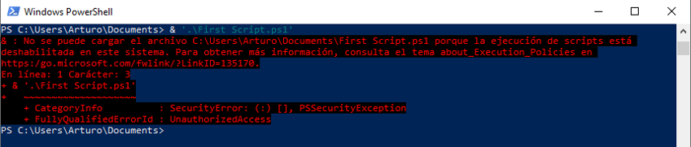
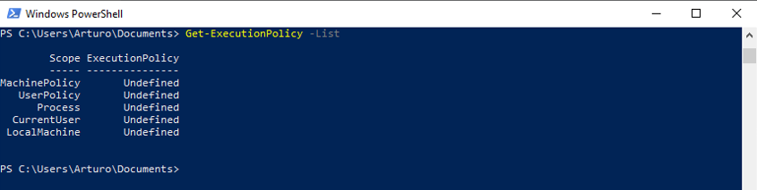
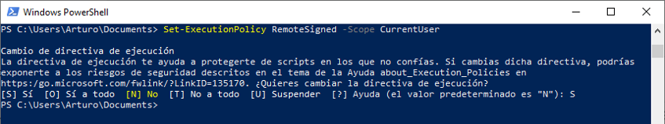
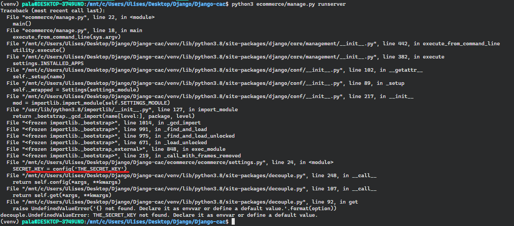
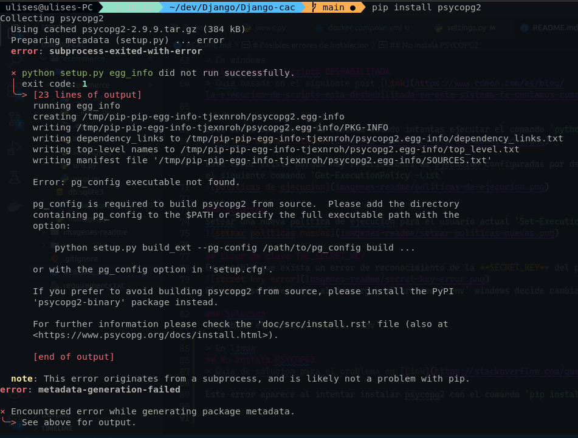

# Proyecto Django-académico #14
Proyecto web creado utilizando el framework de desarrollo Django

## Integrantes
- Ulises Palazzo
- Lina Mendieta
- Julio Duhalde
- Timoteo Pregot
- Ramiro Burgos

## Indice
- [Instalación de entorno para desarrollo](#instalación-de-entorno-para-desarrollo)
    - [Pre-requisitos](#pre-requisitos)
    - [Pasos](#pasos)
- [Posibles errores de instalacion](#posibles-errores-de-instalacion)
    - [Ejecucion de scripts Deshabilitada](#ejecucion-de-scripts-deshabilitada)

# Instalación de entorno para desarrollo
El repositorio es publico y de finalidad académica, cualquiera que desee desarrollar sobre este proyecto debe seguir los siguientes pasos.

## Pre-requisitos
- Python3 (version utilizada 3.10)
- virtualenv (version utilizada 20.17.1) #opcional
- Git (version utilizada 2.34.1)
- 

## Pasos

#### Clonar el repositorio
~~~ git
git clone https://github.com/pala83/Django-cac.git
~~~

#### Crear un entorno virtual y activarlo
~~~ git
cd Django-cac
python3 -m venv venv
~~~
> activacion en windows
~~~ git
cd .\venv\Scripts
.\activate
cd ../..
~~~
> activacion en linux
~~~ git
source venv/bin/activate
~~~

#### instalar dependencias
~~~ git
pip install -r requirements.txt
~~~

#### Variables de entorno
necesarias para poder utilizar el proyecto
> Solicitar el archivo .env al dueño del repositorio
- Pegar el archivo **.env** dentro de la carpeta ecommerce/ecommerce/

# Posibles errores de instalacion

> En windows
## Ejecucion de scripts DESHABILITADA
> Guia basada en el siguiente post [Link](https://www.cdmon.com/es/blog/la-ejecucion-de-scripts-esta-deshabilitada-en-este-sistema-te-contamos-como-actuar)

Este error aparece en la consola cuando intentas ejecutar el comando `python manage.py runserver`

Este error existe porque hay restricciones de ejecucion configuradas por defecto en windows, se pueden observar utilizando el siguiente comando `Get-ExecutionPolicy -List`

### Solucion
Setear una nueva politica de ejecucion para el usuario actual `Set-ExecutionPolicy RemoteSigned -Scope CurrentUser`

## Error de clave THE_SECRET_KEY
Es posible que exista un error de reconocimiento de la **SECRET_KEY** del proyecto al ejecutar `python manage.py runserver`

El error se debe a que al descargar el archivo `.env` windows decide cambiarle el nombre a `env`

### Solucion
Renombrar el archivo `env` a `.env`

> En linux
## No instala PSYCOPG2
> Guia de solucion para el problema en [Link](https://stackoverflow.com/questions/11618898/pg-config-executable-not-found)

Este error aparece al intentar instalar psycopg2 con el comando `pip install psycopg2`

### Solucion
Instalar la dependencia que contiene las configuraciones de desarrollo para utilizar `postgres-devel`  
Dependencia `libpq-dev` en Debian/Ubuntu, `libpq-devel` en Centos/Fedora/Cygwin/Babun.

**Instalacion para Debian:** `sudo apt install libpq-dev`
